Block Diagrams
==============

svblock can render **block diagrams** showing how modules are instantiated and
connected inside a parent module. This is useful for visualizing module hierarchy
and data-flow at a glance, without the detail of individual port pins.

.. raw:: html

   

.. image:: _static/examples/block_simple.svg
   :alt: Block diagram of a top module with three sub-modules

.. raw:: html

   

Quick Start
-----------

Use ``--block-diagram`` to switch from pin-diagram mode to block-diagram mode:

.. code-block:: bash

   svblock top.sv --block-diagram -m top

This analyses the module ``top``, discovers its child instances and their
internal connections, and renders them as boxes with directional arrows.

How It Works
------------

The block diagram pipeline extracts hierarchy information from the elaborated
SystemVerilog design:

1. **Instance discovery** -- finds all ``module_type inst_name(...)``
   instantiations inside the parent module
2. **Connectivity analysis** -- traces which internal nets connect output ports
   of one instance to input ports of another
3. **Direction inference** -- if instance A only drives signals into instance B,
   a single-headed arrow is drawn (``A -> B``). If signals flow both ways, a
   double-headed arrow is used (``A <-> B``)
4. **Parent port tracking** -- identifies which parent I/O ports connect to
   which child instances (optionally shown with ``--show-parent-ports``)

Basic Example
-------------

Consider a ``top`` module that instantiates three sub-modules: ``mod_a``,
``mod_b``, and ``mod_c``. Modules ``a`` and ``b`` each drive signals into ``c``,
but ``a`` and ``b`` have no direct connection between them.

.. code-block:: systemverilog

   module top(
       input  logic        clk,
       input  logic [7:0]  x,
       output logic [7:0]  y
   );
       logic [7:0] a_to_c, b_to_c;

       mod_a u_a(.clk(clk), .data_in(x),     .data_out(a_to_c));
       mod_b u_b(.clk(clk), .b_in(x),        .b_out(b_to_c));
       mod_c u_c(.clk(clk), .c_in1(a_to_c),  .c_in2(b_to_c), .c_out(y));
   endmodule

.. code-block:: bash

   svblock top.sv --block-diagram -m top

.. raw:: html

   

.. image:: _static/examples/block_simple.svg
   :alt: Block diagram: u_a and u_b both feed into u_c

.. raw:: html

   

The layout places instances in **topological order** -- sources on the left,
sinks on the right. This keeps the diagram deterministic and diffable, consistent
with svblock's design philosophy.

Showing Parent Ports
--------------------

Add ``--show-parent-ports`` to display the parent module's I/O ports on the
outer boundary, with dashed lines showing how they connect to child instances:

.. code-block:: bash

   svblock top.sv --block-diagram --show-parent-ports -m top

.. raw:: html

   

.. raw:: html

   

Input ports (``clk``, ``x``) appear on the left edge and output ports (``y``)
on the right edge of the parent boundary.

Bidirectional Connections
-------------------------

When two instances exchange signals in both directions, svblock draws a
double-headed arrow:

.. code-block:: systemverilog

   module top_bidir(
       input  logic        clk,
       input  logic [7:0]  x,
       output logic [7:0]  y
   );
       logic [7:0] a2b, b2a;

       mod_a u_a(.clk(clk), .from_b(b2a), .to_b(a2b));
       mod_b u_b(.clk(clk), .from_a(a2b), .to_a(b2a));

       assign y = a2b ^ b2a;
   endmodule

.. raw:: html

   

.. raw:: html

   

Theme Support
-------------

Block diagrams support all built-in themes. The dark theme works particularly
well for presentations:

.. code-block:: bash

   svblock top.sv --block-diagram -m top --theme dark

.. raw:: html

   

.. raw:: html

   

Custom themes can set these block-diagram-specific CSS variables:

.. list-table::
   :header-rows: 1
   :widths: 35 20 45

   * - Variable
     - Default
     - Description
   * - ``--sym-arrow``
     - ``#555555``
     - Arrow stroke and arrowhead fill colour
   * - ``--sym-instance-bg``
     - ``#f8f8f8``
     - Child instance box background
   * - ``--sym-instance-border``
     - ``#333333``
     - Child instance box border
   * - ``--sym-parent-border``
     - ``#999999``
     - Parent boundary stroke
   * - ``--sym-parent-bg``
     - ``#ffffff``
     - Parent boundary fill

Arrow Reference
---------------

.. list-table::
   :header-rows: 1
   :widths: 25 75

   * - Arrow Style
     - Meaning
   * - Single arrowhead (``-->``)
     - Signals flow in one direction only (output to input)
   * - Double arrowhead (``<-->``)
     - Signals flow in both directions between the two instances

Arrows are drawn as thick (3px) lines between instance box edges. The layout
engine routes arrows from the right edge of the source box to the left edge of
the target box when they are in different topological columns.

CLI Options
-----------

``--block-diagram``
    Switch to block diagram mode. Instead of rendering a single module's pin
    diagram, render the internal structure of the module showing its child
    instances and their connections.

``--show-parent-ports``
    Show the parent module's I/O ports on the outer boundary with dashed lines
    to connected child instances. Only used with ``--block-diagram``.

Both options combine with existing flags like ``--theme``, ``-f png``, ``-o``,
and ``-m``.
